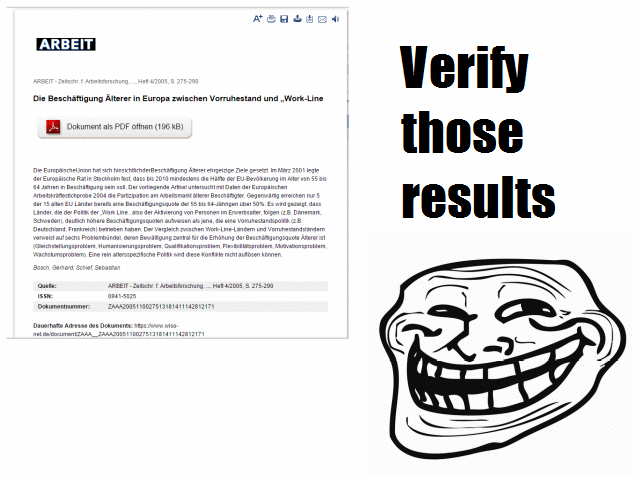

# infolis-button

Enhance your academic browsing with links to research data

## Note

This is currently in proof-of-concept state and works only on an
experimental subset of a few of the links found by the
[infoLink](https://github.com/infolis/infoLink) algorithm.

## Installation

* Install Chrome or Chromium
* Install the [Tampermonkey extension](https://chrome.google.com/webstore/detail/tampermonkey/dhdgffkkebhmkfjojejmpbldmpobfkfo?hl=de) for user scripting
* Install the [infolis-button user script](https://www-test.bib.uni-mannheim.de/infolis/infolis-button/infolis-button.user.js)
* Try it on one the following sites:
    * [Google scholar search for 'stock market price prediction'](https://scholar.google.com/scholar?as_ylo=2016&q=stock+market+price+prediction&hl=en&as_sdt=1,5&as_vis=1)
    * [Kratz, Strasser (2015) Researcher Perspectives on Publication and Peer Review of Data](http://journals.plos.org/plosone/article?id=10.1371/journal.pone.0117619)
    * ...

## Usage

Hover over the circle in the top-left corner to make the button appear.

Click once to activate it, the button will look for publications in the page.

Click again to start querying the Infolis database for references.

Click yet again to see a breakdown of the linked datasets and databases.

You can filter the results of a search by name or reference type.
